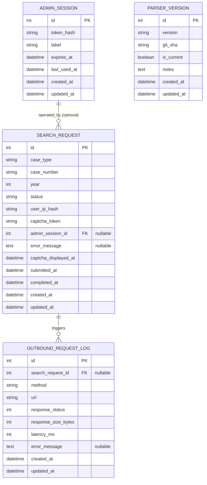

# Delhi HC Case Tracker — Data Model (v1 MVP)

**Owner:** Rohit (Database)
**Status:** Draft — pending DBA review
**Last updated:** 2026-05-17 (GREEN-ZONE rip-out)
**DB engines targeted:** SQLite 3.40+ (MVP), PostgreSQL 15+ (v2-ready)

> **2026-05-17 GREEN-ZONE update.** Per owner directive: *"NO long-term
> database storage of court data."* The three court-data tables that
> previously persisted parsed results — `parsed_case`, `case_party`,
> `case_order` — have been **removed from the schema**. They are
> replaced by an in-process TTL'd cache (`app.cache.InMemoryCaseCache`,
> 24h hard TTL). See §4.8 below. Migration `0002_remove_case_data_tables`
> drops the tables; its `downgrade()` re-creates them verbatim from 0001
> so the rip-out is reversible if the directive is ever rescinded.
>
> The remaining tables (`search_request`, `outbound_request_log`,
> `parser_version`, `admin_session`) hold no court data — only audit
> trail, operability metadata, and admin-auth material — and survive
> the rip-out.

---

## 1. Design principles

1. **Engine-portable.** Only column types that exist in both SQLite and PostgreSQL: `Integer`, `String(n)`, `Text`, `DateTime`, `Boolean`, `ForeignKey`. No `JSONB`, no `ARRAY`, no `tsvector`.
2. **No raw PII.** User IP addresses are hashed (HMAC-SHA256) before storage. No user accounts in MVP.
3. **No court-data persistence.** GREEN-ZONE directive. The court site is the source of truth; we hold ephemeral, in-process copies only.
4. **Every row is timestamped.** `created_at` + `updated_at` on every table, server-default to current UTC.
5. **Every FK is named, every FK has an `ON DELETE` rule.** No floating orphans.
6. **Every column used in a `WHERE` or `JOIN` has an index.** Documented per-table.
7. **Naming convention** (Alembic):
   - PK: `pk_<table>`
   - FK: `fk_<table>_<column>_<reftable>`
   - Unique: `uq_<table>_<column>`
   - Index: `ix_<table>_<column>`
   - Check: `ck_<table>_<name>`
8. **Soft state, not soft delete.** No `is_deleted` columns in v1 — retention jobs hard-delete or anonymize.

---

## 2. Query patterns the schema must serve

Drives every index decision below. Source: Arnav's API contract + Arjun's service code.

| # | Pattern | Frequency | Driven by |
|---|---|---|---|
| Q1 | Look up cached parsed case by `(case_type, case_number, year)` for cache-hit on inbound search | Hot — every search | `POST /search` (in-memory cache, NOT a DB query) |
| Q2 | Update `search_request` lifecycle by `id` (initialized → captcha_displayed → submitted → success/failed) | Hot | Session FSM |
| Q3 | List recent `search_request` rows for an admin dashboard, filtered by `status` and `created_at` window | Warm | Admin UI |
| Q6 | Find all `outbound_request_log` rows in the last N minutes for rate-limit accounting | Warm | Rate limiter |
| Q9 | Validate `admin_session.token_hash` and check `expires_at > now` | Warm | Admin auth middleware |
| Q10 | Anonymize `search_request` rows older than 90 days (rotate `user_ip_hash`) | Daily batch | Retention job *(not yet implemented — see §5)* |
| Q11 | Delete `outbound_request_log` rows older than 30 days | Daily batch | Retention job *(not yet implemented — see §5)* |

Q4 / Q5 / Q7 / Q8 from the pre-GREEN-ZONE version of this doc (hydrate parties / orders for a parsed_case, cache eviction scan, reparse-on-bump) **no longer apply** — those queries operated against the now-removed court-data tables. Their equivalents in the in-memory cache need no indexes (Python dict lookup on the natural-key tuple).

---

## 3. ER diagram (post-rip-out)

> Note: `PARSER_VERSION` is intentionally orphaned in the diagram — it
> used to be the parent of `parsed_case`, but `parsed_case` no longer
> exists. The table is kept for operability metadata (which parser
> version a deploy is running, when it was promoted).

---

## 4. Per-table specification

### 4.1 `search_request`

**Purpose:** One row per user click on "Search". Tracks the full lifecycle of one human-driven search attempt. The audit trail for "what did this IP ask the court". **Stores only the user's request (case identifiers + IP hash) — never the court's response.**

| Column | Type | Constraints | Notes |
|---|---|---|---|
| `id` | Integer | PK, autoincrement | |
| `case_type` | String(32) | NOT NULL | e.g. "W.P.(C)" |
| `case_number` | String(32) | NOT NULL | court filing number |
| `year` | Integer | NOT NULL, CHECK 1950 <= year <= 2100 | |
| `status` | String(32) | NOT NULL, default `'initialized'`, CHECK in (`initialized`, `captcha_displayed`, `submitted`, `success`, `failed`, `expired`) | FSM |
| `user_ip_hash` | String(64) | NOT NULL | HMAC-SHA256(IP, server_secret). Rotated at 90d. |
| `captcha_token` | String(64) | NULL | opaque court-side token, present only during the captcha window |
| `admin_session_id` | Integer | FK → `admin_session.id` ON DELETE SET NULL, NULL | only if invoked from admin tooling |
| `error_message` | Text | NULL | populated when status='failed' |
| `captcha_displayed_at` | DateTime | NULL | |
| `submitted_at` | DateTime | NULL | |
| `completed_at` | DateTime | NULL | success or failed |
| `created_at` | DateTime | NOT NULL, server-default `CURRENT_TIMESTAMP` | |
| `updated_at` | DateTime | NOT NULL, server-default `CURRENT_TIMESTAMP`, on update | |

> The pre-GREEN-ZONE `parsed_case_id` FK column has been removed by `0002_remove_case_data_tables`.

**Indexes:**
- `ix_search_request_status_created_at` (status, created_at DESC) — serves Q3 (admin dashboard listing).
- `ix_search_request_created_at` (created_at) — serves Q10 (90-day retention scan).
- `ix_search_request_user_ip_hash` (user_ip_hash) — serves per-IP abuse detection (Sneha will want this).

**FKs:**
- `fk_search_request_admin_session_id_admin_session` ON DELETE SET NULL.

**Retention:** 90 days. A daily job re-hashes `user_ip_hash` with a rotated secret so rows become un-correlatable to a real IP but lifecycle metrics still aggregate. **Status: not yet implemented — owner decision pending whether to ship in v1 or defer past the spike.**

---

### 4.2–4.4 `parsed_case`, `case_party`, `case_order` — **REMOVED (GREEN-ZONE)**

These tables were dropped by migration `0002_remove_case_data_tables`. The replacement is the in-process cache documented in §4.8. The downgrade path in that migration recreates them verbatim (DDL pasted from 0001) so a rollback is faithful, but the directive forbids re-running it without explicit owner sign-off.

---

### 4.5 `outbound_request_log`

**Purpose:** Every HTTP call we make to the court site. Powers rate-limit accounting, latency monitoring, and post-incident forensics ("did the court 503 us at 14:02?").

| Column | Type | Constraints | Notes |
|---|---|---|---|
| `id` | Integer | PK | |
| `search_request_id` | Integer | FK → `search_request.id` ON DELETE SET NULL, NULL | nullable: background calls (e.g. health checks) have no parent search |
| `method` | String(8) | NOT NULL | GET / POST |
| `url` | String(1024) | NOT NULL | |
| `response_status` | Integer | NULL | NULL if the request errored before a response |
| `response_size_bytes` | Integer | NULL | |
| `latency_ms` | Integer | NULL | |
| `error_message` | Text | NULL | populated on transport-level errors |
| `created_at` | DateTime | NOT NULL, server-default | |
| `updated_at` | DateTime | NOT NULL, server-default, on update | |

**Indexes:**
- `ix_outbound_request_log_created_at` (created_at) — serves Q6 (rate-limit window) and Q11 (retention scan).
- `ix_outbound_request_log_search_request_id` (search_request_id) — forensic queries: "show me every outbound call this search made".

**FKs:**
- `fk_outbound_request_log_search_request_id_search_request` ON DELETE SET NULL — preserve audit trail when a search row is anonymized/deleted.

**Retention:** Keep 30 days hot. Older rows → daily job dumps to flat file (gzipped NDJSON) under `infrastructure/archives/outbound_request_log/YYYY-MM-DD.ndjson.gz` and deletes from DB. *(Job not built in v1 — documented hook only.)*

---

### 4.6 `parser_version`

**Purpose:** Tracks parser code versions for operability. Originally also linked back to `parsed_case` rows for re-parse-on-bump; that relationship no longer exists because the cache is in-memory only and a parser bump simply invalidates the cache on restart.

| Column | Type | Constraints | Notes |
|---|---|---|---|
| `id` | Integer | PK | |
| `version` | String(32) | NOT NULL, UNIQUE | e.g. "1.0.0", "1.0.1" |
| `git_sha` | String(40) | NOT NULL | commit that built this parser |
| `is_current` | Boolean | NOT NULL, default False | exactly one row is True (enforced in app, not DB — partial-unique indexes aren't portable to SQLite) |
| `notes` | Text | NULL | what changed |
| `created_at` | DateTime | NOT NULL, server-default | |
| `updated_at` | DateTime | NOT NULL, server-default, on update | |

**Indexes:**
- `ix_parser_version_is_current` (is_current) — serves "find current parser version".

**Constraints:**
- `uq_parser_version_version` UNIQUE (version).

**Retention:** Never. Audit/lineage data.

---

### 4.7 `admin_session`

**Purpose:** MVP-only opaque admin tokens. Shared-secret-style: an operator gets a bearer token, we store its SHA256. **Full auth (OAuth/JWT) lands in v2.** Sneha is aware.

| Column | Type | Constraints | Notes |
|---|---|---|---|
| `id` | Integer | PK | |
| `token_hash` | String(64) | NOT NULL, UNIQUE | SHA-256 of the raw token; raw never stored |
| `label` | String(128) | NOT NULL | human-readable, e.g. "rohit-laptop-2026-05" |
| `expires_at` | DateTime | NOT NULL | |
| `last_used_at` | DateTime | NULL | updated on every successful auth |
| `created_at` | DateTime | NOT NULL, server-default | |
| `updated_at` | DateTime | NOT NULL, server-default, on update | |

**Indexes:**
- `uq_admin_session_token_hash` UNIQUE (token_hash) — serves Q9. Unique index doubles as the lookup index.
- `ix_admin_session_expires_at` (expires_at) — serves expiry sweeps.

**Retention:** Hard-delete on expiry + 7 days.

---

### 4.8 Caching layer (NOT persisted) — `InMemoryCaseCache`

**Purpose:** Replaces the removed `parsed_case` / `case_party` / `case_order` tables. Saves the court from being hammered for the same case repeatedly within a 24h window, **without** persisting any court data to disk.

**Where it lives:** `backend/app/cache/in_memory_case_cache.py`. One singleton per process, wired via `app.services.dependencies.get_case_cache()`.

**Why in-memory (not Redis, not a DB):** The GREEN-ZONE directive is unambiguous — "NO long-term database storage of court data". A best-effort cleanup-job-against-a-DB is a runtime *promise*, not a *guarantee*. A process-local dict that vanishes on restart is the most honest implementation of the rule.

**Shape:**

| Key | Value |
|---|---|
| `(case_type, case_number, year)` (normalised: leading zeros stripped from `case_number`) | `_Entry(case: ParsedCase, expires_at: float)` |

**API (async):**

| Method | Returns | Notes |
|---|---|---|
| `get(case_type, case_number, year)` | `ParsedCase \| None` | Single-pass sweep removes any expired keys it encounters. Hits bump `hits`; misses bump `misses`; on-the-fly expirations bump `expirations` AND `misses`. |
| `put(case_type, case_number, year, case)` | `None` | Overwrites. `expires_at = now + ttl`. |
| `stats()` | `CacheStats(size, hits, misses, expirations, ttl_seconds)` | For `/api/v1/admin` observability — not yet wired into the admin router (Sneha + Arjun to scope). |

**TTL:** Default 24h (`settings.parsed_case_cache_ttl_seconds = 86_400`). Constructor refuses any value > 86_400 — the directive caps cache at 24h and the cache enforces that ceiling at runtime.

**Concurrency:** One `asyncio.Lock` protects the dict. Single-process FastAPI app. Multi-worker deployments would need Redis (v2 swap; `cache_backend=redis` is rejected at startup until then).

**Restart behaviour:** Cache is wiped. First search for every case after a restart is a guaranteed miss — that's the design.

**No background sweeper:** Eviction happens during `get()`. No `asyncio.create_task` loop in lifespan. One fewer moving part to break.

---

## 5. Privacy & PII notes (for Sneha)

- We store `user_ip_hash`, **not** raw IPs. Hash is `HMAC-SHA256(ip, server_secret)`; secret rotates every 90 days via the retention job, severing back-correlation. **The HMAC-with-rotated-secret job is documented but not implemented; today's code uses a plain SHA-256 placeholder, which Sneha must swap before launch.**
- We store no user identity in MVP. No emails, no names, no accounts.
- We **do not store court data**. Petitioner/respondent names that previously lived in `case_party` are now held only in the in-memory cache and only for the TTL window. They never touch disk.
- `admin_session` stores `token_hash` only. Raw tokens are shown to the admin once on issue, never again.

## 6. Migration & rollout

- v1 shipped with `0001_initial_schema.py`.
- **GREEN-ZONE follow-on:** `0002_remove_case_data_tables.py` drops the three court-data tables + `search_request.parsed_case_id`. Idempotent-safe (no-op if the tables are already gone, because Alembic tracks revision state in `alembic_version`).
- SQLite file lives at `backend/data/casetracker.db` (gitignored).
- Foreign-key enforcement is enabled per-connection on SQLite via `PRAGMA foreign_keys=ON` in `backend/app/db/session.py`.
- Postgres path (v2): same migrations run unmodified. The `batch_alter_table` in 0002 is a no-op on Postgres.

## 7. Open questions

- **OQ1:** Do we surface `cache.stats()` on `/api/v1/admin/cache` for operator visibility? Tiny endpoint; defers to Sneha for whether the snapshot is considered observability-only or admin-only.
- **OQ2:** Owner call required: do we ship the 90-day `search_request` anonymisation job in v1, or defer past the post-spike review? It is a single async cron, ~30 lines.
- **OQ3:** If we ever sanction multi-worker deployment in v1, we MUST move the cache out of process. Until then, `cache_backend=redis` is rejected at startup — fail loud, not silently.
