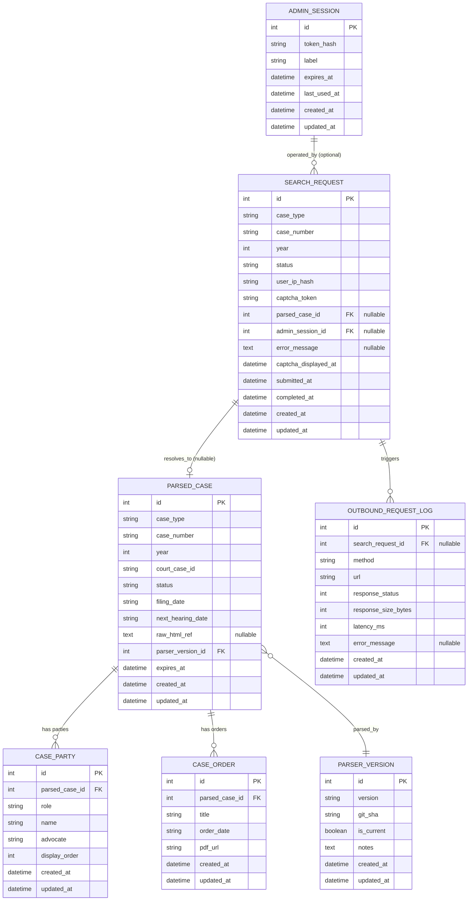

# Delhi HC Case Tracker — Data Model (v1 MVP)

**Owner:** Rohit (Database)
**Status:** Draft — pending DBA review
**Last updated:** 2026-05-17
**DB engines targeted:** SQLite 3.40+ (MVP), PostgreSQL 15+ (v2-ready)

---

## 1. Design principles

1. **Engine-portable.** Only column types that exist in both SQLite and PostgreSQL: `Integer`, `String(n)`, `Text`, `DateTime`, `Boolean`, `ForeignKey`. No `JSONB`, no `ARRAY`, no `tsvector`.
2. **No raw PII.** User IP addresses are hashed (HMAC-SHA256) before storage. No user accounts in MVP.
3. **Every row is timestamped.** `created_at` + `updated_at` on every table, server-default to current UTC.
4. **Every FK is named, every FK has an `ON DELETE` rule.** No floating orphans.
5. **Every column used in a `WHERE` or `JOIN` has an index.** Documented per-table.
6. **Naming convention** (Alembic):
   - PK: `pk_<table>`
   - FK: `fk_<table>_<column>_<reftable>`
   - Unique: `uq_<table>_<column>`
   - Index: `ix_<table>_<column>`
   - Check: `ck_<table>_<name>`
7. **Soft state, not soft delete.** No `is_deleted` columns in v1 — retention jobs hard-delete or anonymize.

---

## 2. Query patterns the schema must serve

Drives every index decision below. Source: Arnav's API contract + Arjun's planned service code.

| # | Pattern | Frequency | Driven by |
|---|---|---|---|
| Q1 | Look up cached parsed case by `(case_type, case_number, year)` for cache-hit on inbound search | Hot — every search | `POST /search` |
| Q2 | Update `search_request` lifecycle by `id` (initialized → captcha_displayed → submitted → success/failed) | Hot | Session FSM |
| Q3 | List recent `search_request` rows for an admin dashboard, filtered by `status` and `created_at` window | Warm | Admin UI |
| Q4 | List parties for a given `parsed_case_id` (1-to-N hydrate) | Hot — every cache hit | Parser output assembly |
| Q5 | List orders for a given `parsed_case_id` | Hot | Same |
| Q6 | Find all `outbound_request_log` rows in the last N minutes for rate-limit accounting | Warm | Rate limiter |
| Q7 | Find all `parsed_case` rows older than TTL (24h) for cache eviction | Background | Eviction worker |
| Q8 | Find all `parsed_case` rows where `parser_version_id < current` for re-parse on parser bump | Rare | Reparse worker |
| Q9 | Validate `admin_session.token_hash` and check `expires_at > now` | Warm | Admin auth middleware |
| Q10 | Anonymize `search_request` rows older than 90 days (rotate `user_ip_hash`) | Daily batch | Retention job |
| Q11 | Delete `outbound_request_log` rows older than 30 days | Daily batch | Retention job |

---

## 3. ER diagram

---

## 4. Per-table specification

### 4.1 `search_request`

**Purpose:** One row per user click on "Search". Tracks the full lifecycle of one human-driven search attempt. The audit trail for "what did this IP ask the court".

| Column | Type | Constraints | Notes |
|---|---|---|---|
| `id` | Integer | PK, autoincrement | |
| `case_type` | String(32) | NOT NULL | e.g. "W.P.(C)" |
| `case_number` | String(32) | NOT NULL | court filing number |
| `year` | Integer | NOT NULL, CHECK 1950 <= year <= 2100 | |
| `status` | String(32) | NOT NULL, default `'initialized'`, CHECK in (`initialized`, `captcha_displayed`, `submitted`, `success`, `failed`, `expired`) | FSM |
| `user_ip_hash` | String(64) | NOT NULL | HMAC-SHA256(IP, server_secret). Rotated at 90d. |
| `captcha_token` | String(64) | NULL | opaque court-side token, present only during the captcha window |
| `parsed_case_id` | Integer | FK → `parsed_case.id` ON DELETE SET NULL, NULL | only set on success |
| `admin_session_id` | Integer | FK → `admin_session.id` ON DELETE SET NULL, NULL | only if invoked from admin tooling |
| `error_message` | Text | NULL | populated when status='failed' |
| `captcha_displayed_at` | DateTime | NULL | |
| `submitted_at` | DateTime | NULL | |
| `completed_at` | DateTime | NULL | success or failed |
| `created_at` | DateTime | NOT NULL, server-default `CURRENT_TIMESTAMP` | |
| `updated_at` | DateTime | NOT NULL, server-default `CURRENT_TIMESTAMP`, on update | |

**Indexes:**
- `ix_search_request_status_created_at` (status, created_at DESC) — serves Q3 (admin dashboard listing).
- `ix_search_request_created_at` (created_at) — serves Q10 (90-day retention scan).
- `ix_search_request_user_ip_hash` (user_ip_hash) — serves per-IP abuse detection (Sneha will want this).
- `ix_search_request_parsed_case_id` (parsed_case_id) — FK back-reference for "who searched this case".

**FKs:**
- `fk_search_request_parsed_case_id_parsed_case` ON DELETE SET NULL (cache can evict; search history survives).
- `fk_search_request_admin_session_id_admin_session` ON DELETE SET NULL.

**Retention:** 90 days. Daily job re-hashes `user_ip_hash` with a rotated secret so rows become un-correlatable to a real IP but lifecycle metrics still aggregate.

---

### 4.2 `parsed_case`

**Purpose:** TTL-bounded cache of parsed court results. Keyed on the natural key (case_type, case_number, year). Saves the court from being hammered for the same case repeatedly within the TTL window.

| Column | Type | Constraints | Notes |
|---|---|---|---|
| `id` | Integer | PK | |
| `case_type` | String(32) | NOT NULL | |
| `case_number` | String(32) | NOT NULL | |
| `year` | Integer | NOT NULL | |
| `court_case_id` | String(128) | NULL | internal court-side ID if exposed by the result page |
| `status` | String(64) | NULL | e.g. "Pending", "Disposed" — as scraped |
| `filing_date` | String(32) | NULL | stored as ISO string; not all sources are clean dates |
| `next_hearing_date` | String(32) | NULL | same — stored as string to preserve fidelity |
| `raw_html_ref` | Text | NULL | pointer/key to raw HTML in object storage (not the HTML itself) |
| `parser_version_id` | Integer | FK → `parser_version.id` ON DELETE RESTRICT, NOT NULL | RESTRICT — never lose lineage |
| `expires_at` | DateTime | NOT NULL | created_at + 24h by default |
| `created_at` | DateTime | NOT NULL, server-default | |
| `updated_at` | DateTime | NOT NULL, server-default, on update | |

**Constraints:**
- `uq_parsed_case_natural_key` UNIQUE (case_type, case_number, year) — only one cache entry per real-world case at a time. Re-parses do an UPSERT.

**Indexes:**
- The natural-key unique constraint above also serves Q1 (cache lookup). No separate index needed.
- `ix_parsed_case_expires_at` (expires_at) — serves Q7 (cache eviction scan).
- `ix_parsed_case_parser_version_id` (parser_version_id) — serves Q8 (reparse-on-bump).

**FKs:**
- `fk_parsed_case_parser_version_id_parser_version` ON DELETE RESTRICT.

**Retention:** Hard-evict when `expires_at < now()`. No archival — the source of truth is the court site.

---

### 4.3 `case_party`

**Purpose:** Petitioners and respondents for a parsed case. Separate table because (a) the count is variable, (b) querying "all cases for advocate X" is a likely v2 feature, (c) keeps `parsed_case` row width bounded.

| Column | Type | Constraints | Notes |
|---|---|---|---|
| `id` | Integer | PK | |
| `parsed_case_id` | Integer | FK → `parsed_case.id` ON DELETE CASCADE, NOT NULL | child of parsed_case |
| `role` | String(16) | NOT NULL, CHECK in (`petitioner`, `respondent`) | |
| `name` | String(255) | NOT NULL | |
| `advocate` | String(255) | NULL | |
| `display_order` | Integer | NOT NULL, default 0 | preserves court-listed ordering |
| `created_at` | DateTime | NOT NULL, server-default | |
| `updated_at` | DateTime | NOT NULL, server-default, on update | |

**Indexes:**
- `ix_case_party_parsed_case_id` (parsed_case_id) — serves Q4 (hydrate parties for a case).
- `ix_case_party_advocate` (advocate) — cheap, anticipates v2 advocate-search feature; ~tens of thousands of rows max in MVP.

**FKs:**
- `fk_case_party_parsed_case_id_parsed_case` ON DELETE CASCADE — parties die with the cached case row.

---

### 4.4 `case_order`

**Purpose:** Links to judgments/interim orders for a parsed case (PDFs on the court site). 1-to-N from parsed_case.

| Column | Type | Constraints | Notes |
|---|---|---|---|
| `id` | Integer | PK | |
| `parsed_case_id` | Integer | FK → `parsed_case.id` ON DELETE CASCADE, NOT NULL | |
| `title` | String(512) | NOT NULL | |
| `order_date` | String(32) | NULL | string for fidelity (same reason as parsed_case dates) |
| `pdf_url` | String(1024) | NOT NULL | court-hosted URL |
| `created_at` | DateTime | NOT NULL, server-default | |
| `updated_at` | DateTime | NOT NULL, server-default, on update | |

**Indexes:**
- `ix_case_order_parsed_case_id` (parsed_case_id) — serves Q5.

**FKs:**
- `fk_case_order_parsed_case_id_parsed_case` ON DELETE CASCADE.

---

### 4.5 `outbound_request_log`

**Purpose:** Every HTTP call we make to the court site. Powers rate-limit accounting, latency monitoring, and post-incident forensics ("did the court 503 us at 14:02?").

| Column | Type | Constraints | Notes |
|---|---|---|---|
| `id` | Integer | PK | |
| `search_request_id` | Integer | FK → `search_request.id` ON DELETE SET NULL, NULL | nullable: background calls (e.g. health checks) have no parent search |
| `method` | String(8) | NOT NULL | GET / POST |
| `url` | String(1024) | NOT NULL | |
| `response_status` | Integer | NULL | NULL if the request errored before a response |
| `response_size_bytes` | Integer | NULL | |
| `latency_ms` | Integer | NULL | |
| `error_message` | Text | NULL | populated on transport-level errors |
| `created_at` | DateTime | NOT NULL, server-default | |
| `updated_at` | DateTime | NOT NULL, server-default, on update | |

**Indexes:**
- `ix_outbound_request_log_created_at` (created_at) — serves Q6 (rate-limit window) and Q11 (retention scan).
- `ix_outbound_request_log_search_request_id` (search_request_id) — forensic queries: "show me every outbound call this search made".

**FKs:**
- `fk_outbound_request_log_search_request_id_search_request` ON DELETE SET NULL — preserve audit trail when a search row is anonymized/deleted.

**Retention:** Keep 30 days hot. Older rows → daily job dumps to flat file (gzipped NDJSON) under `infrastructure/archives/outbound_request_log/YYYY-MM-DD.ndjson.gz` and deletes from DB. *(Job not built in v1 — documented hook only.)*

---

### 4.6 `parser_version`

**Purpose:** Tracks parser code versions. When golden-fixture tests detect a parser regression, we bump version, mark `is_current=True`, and a background job re-parses cached cases against the new version.

| Column | Type | Constraints | Notes |
|---|---|---|---|
| `id` | Integer | PK | |
| `version` | String(32) | NOT NULL, UNIQUE | e.g. "1.0.0", "1.0.1" |
| `git_sha` | String(40) | NOT NULL | commit that built this parser |
| `is_current` | Boolean | NOT NULL, default False | exactly one row is True (enforced in app, not DB — partial-unique indexes aren't portable to SQLite) |
| `notes` | Text | NULL | what changed |
| `created_at` | DateTime | NOT NULL, server-default | |
| `updated_at` | DateTime | NOT NULL, server-default, on update | |

**Indexes:**
- `ix_parser_version_is_current` (is_current) — serves "find current parser version" on every parse.

**Constraints:**
- `uq_parser_version_version` UNIQUE (version).

**Retention:** Never. Audit/lineage data.

---

### 4.7 `admin_session`

**Purpose:** MVP-only opaque admin tokens. Shared-secret-style: an operator gets a bearer token, we store its SHA256. **Full auth (OAuth/JWT) lands in v2.** Sneha is aware.

| Column | Type | Constraints | Notes |
|---|---|---|---|
| `id` | Integer | PK | |
| `token_hash` | String(64) | NOT NULL, UNIQUE | SHA-256 of the raw token; raw never stored |
| `label` | String(128) | NOT NULL | human-readable, e.g. "rohit-laptop-2026-05" |
| `expires_at` | DateTime | NOT NULL | |
| `last_used_at` | DateTime | NULL | updated on every successful auth |
| `created_at` | DateTime | NOT NULL, server-default | |
| `updated_at` | DateTime | NOT NULL, server-default, on update | |

**Indexes:**
- `uq_admin_session_token_hash` UNIQUE (token_hash) — serves Q9. Unique index doubles as the lookup index.
- `ix_admin_session_expires_at` (expires_at) — serves expiry sweeps.

**Retention:** Hard-delete on expiry + 7 days.

---

## 5. Privacy & PII notes (for Sneha)

- We store `user_ip_hash`, **not** raw IPs. Hash is `HMAC-SHA256(ip, server_secret)`; secret rotates every 90 days via the retention job, severing back-correlation.
- We store no user identity in MVP. No emails, no names, no accounts.
- `case_party.name` is public court-record data and is not PII under Indian privacy law (DPDPA s.3 exception for publicly available personal data). Sneha to confirm before launch.
- `admin_session` stores `token_hash` only. Raw tokens are shown to the admin once on issue, never again.

## 6. Migration & rollout

- v1 ships as a single Alembic migration: `0001_initial_schema.py`.
- SQLite file lives at `backend/data/casetracker.db` (gitignored).
- Foreign-key enforcement must be enabled per-connection on SQLite: `PRAGMA foreign_keys=ON`. Wired in the engine's `connect` event in `backend/app/db.py` (Arjun's task).
- Postgres path (v2): same migration runs unmodified. We then add Postgres-specific optimizations as a follow-on migration (partial indexes, `JSONB` for `raw_html_ref` payloads if we move HTML in-DB).

## 7. Open questions

- **OQ1:** Should `parsed_case.raw_html_ref` point to object storage (S3) or to a sibling on-disk path? Arnav to decide; schema is agnostic.
- **OQ2:** Do we need `case_order.pdf_url` to be unique within a case? Court sometimes lists the same order twice. Holding off on the unique constraint until we see real data.
- **OQ3:** Is `case_party.advocate` ever multi-valued? Spotted some "Mr X with Mr Y" strings in samples. Storing as raw string for v1; normalize in v2 if we ship advocate-search.
