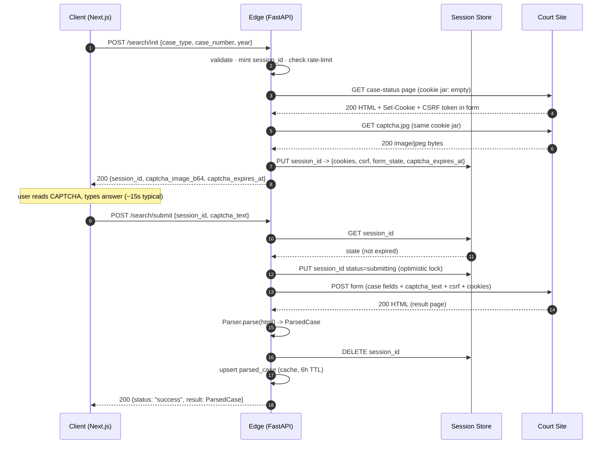
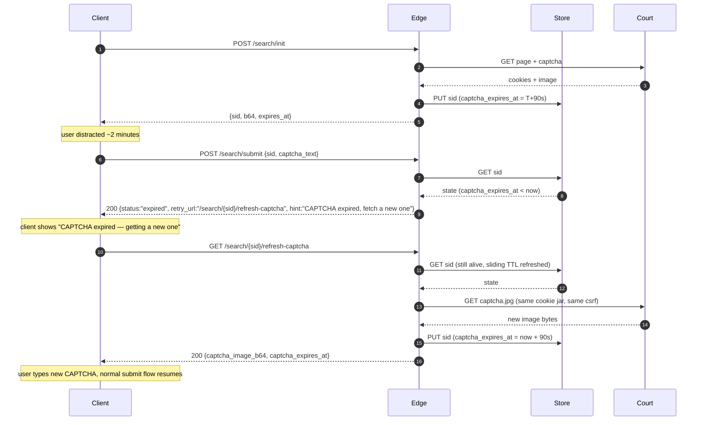
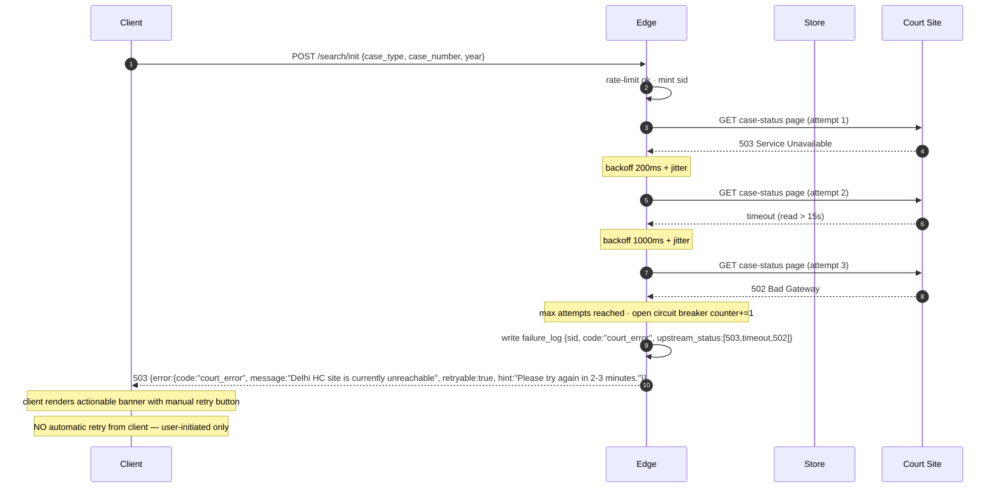

# Delhi HC Case Tracker — Sequence Diagrams

**Status:** Draft v0.1 · **Owner:** Arnav (Architecture) · **Last updated:** 2026-05-17

These diagrams describe protocol-level interaction between the four runtime actors:

- **Client** — Next.js browser
- **Edge** — FastAPI app
- **Store** — Session Store (Redis/SQLite-kv)
- **Court** — Delhi HC public site (upstream)

Parser, Court Client, and Rate-Limiter live inside Edge; collapsed for readability.

---

## 1. Happy Path — search → CAPTCHA → submit → result

### Mermaid



### ASCII fallback

```
Client          Edge              Store           Court
  |  init        |                  |                |
  |------------->|                  |                |
  |              |  rate-limit ok   |                |
  |              |-- GET page ----------------------> |
  |              |<-- 200 + cookies + csrf ---------- |
  |              |-- GET captcha (same jar) --------> |
  |              |<-- image bytes ------------------- |
  |              |-- PUT sid -----> |                |
  |              |<-- ok ---------- |                |
  |<-- sid + b64 + exp ----|        |                |
  |                                                  |
  |  ... user types (~15s) ...                       |
  |                                                  |
  |  submit      |                  |                |
  |------------->|                  |                |
  |              |-- GET sid -----> |                |
  |              |<-- state ------- |                |
  |              |-- PUT submitting>|                |
  |              |-- POST form (jar + captcha) ----> |
  |              |<-- 200 result HTML -------------- |
  |              | parse -> ParsedCase               |
  |              |-- DEL sid -----> |                |
  |              | upsert parsed_case cache          |
  |<-- success + ParsedCase|        |                |
```

---

## 2. CAPTCHA Expired — user waited too long

### Mermaid



### ASCII fallback

```
Client          Edge              Store           Court
  |  init -----> |                  |                |
  |              |---- get page + captcha --------- >|
  |              |<------ cookies + image --------- - |
  |              |-- PUT sid (exp=T+90) ->|          |
  |<-- sid+b64+exp -----------------|                |
  |                                                  |
  |  ... user waits 120s ...                         |
  |                                                  |
  |  submit ---> |                  |                |
  |              |-- GET sid ----> |                |
  |              |<-- state (exp < now) ------------|
  |<-- {status:"expired", retry_url} |               |
  |                                                  |
  |  refresh-captcha ->|             |                |
  |              |-- GET sid ----> |                |
  |              |<-- state ----- |                  |
  |              |-- GET captcha (same jar) ------> |
  |              |<-- new image ------------------- |
  |              |-- PUT sid (exp=now+90) ->|       |
  |<-- new b64 + exp --------------|                |
  |  (resume normal submit)                          |
```

**Why no upstream re-init:** the upstream session/cookies are still valid; only the CAPTCHA image rotates. Re-fetching only the CAPTCHA preserves CSRF + form state and is 1 upstream call instead of 2.

**Edge case:** if the upstream session itself has died (rare), refresh-captcha will discover this when the new image GET returns a redirect or 4xx. In that case Edge tears down the session and returns `status:"expired_session"` with `retry_url` pointing to `/search/init` — user must start over.

---

## 3. Court Site Failure — retries and final failure

### Mermaid



### ASCII fallback

```
Client          Edge                                 Court
  |  init ------>|                                     |
  |              |---- GET page (try 1) -------------> |
  |              |<--- 503 ----------------------------|
  |              | sleep 200ms + jitter                |
  |              |---- GET page (try 2) -------------> |
  |              |  ... 15s timeout ...                |
  |              | sleep 1000ms + jitter               |
  |              |---- GET page (try 3) -------------> |
  |              |<--- 502 ----------------------------|
  |              | circuit_breaker.fail++              |
  |              | failure_log.write(...)              |
  |<-- 503 {error: court_error, retryable, hint} -----|
  |                                                    |
  |  (user sees actionable banner; manual retry only)  |
```

**Backoff schedule:** attempt 1 immediate; attempt 2 at 200ms ± 25%; attempt 3 at 1000ms ± 25%. Total worst-case added latency before user sees error: ~1.5s + 3 × upstream_timeout. With read-timeout 15s × 3 attempts that's ~46s worst case — **too long**. Therefore overall **wall-clock cap** on `/search/init` = 20s; if exceeded, abort retries and return immediately. This is in addition to the per-attempt timeout.

**Circuit-breaker rule:** if 5 consecutive `court_error` outcomes occur within 60s, the breaker opens. While open (5 min), all `/search/init` requests fail fast with `upstream_blocked` and do not consume rate-limit budget. The breaker half-opens after 5 min and tries one probe request.

**What the client shows by code:**

| Code | UI |
|---|---|
| `court_error` | "Delhi HC site is currently unreachable. Try again in a few minutes." + manual retry button |
| `upstream_blocked` | "We're temporarily pausing requests because the court site is unstable. Auto-resume in ~5 min." (no retry button) |
| `captcha_unavailable` | "Couldn't load the security image. Try again." + retry |
| `rate_limited` | "Too many requests. Please wait a moment." (`Retry-After` honored) |

---

## Notes & invariants

- **Client never sees a cookie or CSRF token.** Ever. Only `session_id` (uuid4, opaque).
- **The Edge never retries a `submit` automatically** — only `init`/`refresh-captcha` (idempotent GET-like operations against upstream). A submit is a state-changing action with a one-shot CAPTCHA; auto-retrying would burn the user's CAPTCHA and confuse upstream.
- **All upstream calls share the same cookie jar within a session.** New jar = new session.
- **`session_id` is never reused** across browser tabs; the frontend mints one per search attempt.
